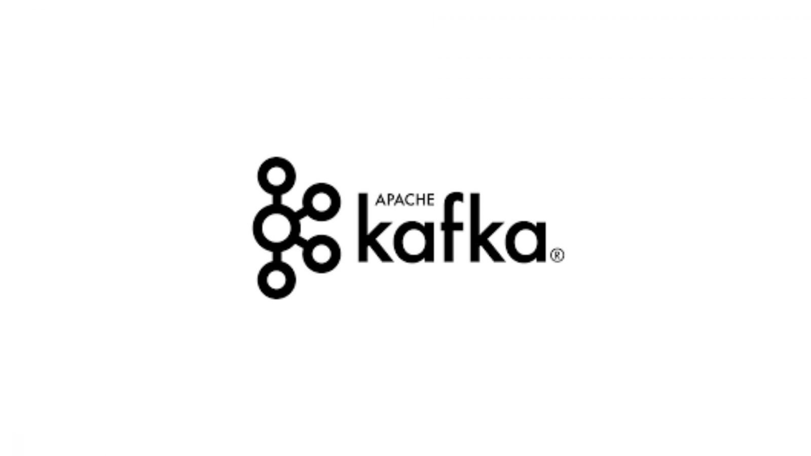
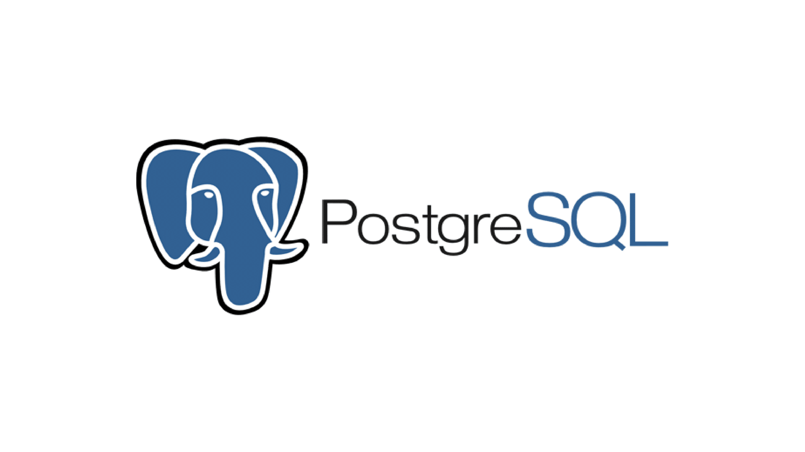
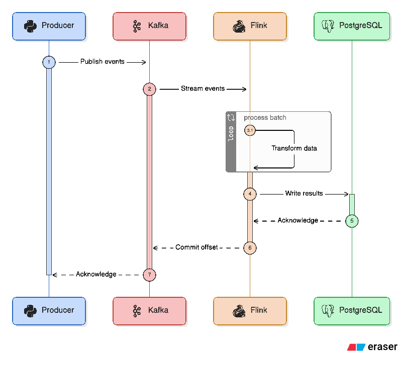

<h1 align="center">
  <span>𝘼𝙥𝙖𝙘𝙝𝙚 𝙁𝙡𝙞𝙣𝙠 · 𝙆𝙖𝙛𝙠𝙖</span>
</h1>

<p align="center">
  
    
</p>

<p align="center">
  <em>Stream processing with PyFlink: Redpanda/Kafka, Flink SQL/Table API, PostgreSQL sinks, and homework deliverables</em>
</p>

## Overview

This repository consolidates Module 7 (Streaming with Flink) work:

- a full workshop guide to build a streaming pipeline end to end, with code and SQL
- a homework/project guide with Docker Compose, Flink jobs, and a helper script
- reference images and a minimal Python project scaffold

## Environment

From `pyproject.toml`:

- Python `>= 3.12, < 3.13`

Workshop prerequisites (see `workshop/README.md`):

- Docker and Docker Compose
- `uv` (recommended) or `pip` for Python deps
- A SQL client (pgcli, DBeaver, pgAdmin, DataGrip)

## Quick Start

Minimal local check:

```bash
uv sync
source .venv/bin/activate
python main.py
```

For the full streaming stack, follow `workshop/README.md`.

## Data Sources Used

- Yellow Taxi November 2025 parquet (workshop examples):
  - `https://d37ci6vzurychx.cloudfront.net/trip-data/yellow_tripdata_2025-11.parquet`
- Green Taxi October 2025 parquet (homework):
  - `https://d37ci6vzurychx.cloudfront.net/trip-data/green_tripdata_2025-10.parquet`

## Tech Stack

<p align="center">
  
</p>

<p align="center">
  
</p>

<p align="center">
  
</p>

<p align="center">
  
</p>

## Repository Map

```text
.
├── README.md
├── main.py
├── pyproject.toml
├── uv.lock
├── .python-version
├── .gitignore
├── ressources/
│   └── pictures/
│       ├── apache_flink_banner.jpg
│       ├── apache_flink_logo.png
│       ├── apache_kafka_logo3.png
│       ├── article_kafka_banner.textClipping
│       ├── redpanda_banner.jpg
│       ├── redpanda_logo.png
│       └── workshop_flow.png
├── workshop/
│   ├── README.md
│   ├── docker-compose.yml
│   ├── Dockerfile.flink
│   ├── flink-config.yaml
│   ├── pyproject.flink.toml
│   ├── notebooks/
│   │   └── nyc_yellow_taxi.py
│   ├── scripts/
│   │   ├── py/
│   │   │   └── test.py
│   │   └── sql/
│   │       ├── aggregation_table.sql
│   │       ├── processed_event.sql
│   │       ├── processed_events_aggregated.sql
│   │       └── test.sql
│   └── src/
│       ├── models.py
│       ├── consumers/
│       │   ├── consumer.py
│       │   └── consumer_postgres.py
│       ├── producers/
│       │   ├── producer.py
│       │   └── producer_realtime.py
│       └── job/
│           ├── aggregation_job.py
│           ├── aggregation_job_demo.py
│           └── pass_through_job.py
└── project/
    ├── README.md
    ├── docker-compose.yml
    ├── Dockerfile.flink
    ├── flink-config.yaml
    ├── pyproject.flink.toml
    ├── run_all.sh
    ├── sql/
    │   └── create_tables.sql
    ├── ressources/
    │   └── pictures/
    │       ├── q4.png
    │       ├── q5.png
    │       └── q6.png
    └── src/
        ├── consumers/
        │   └── consumer_green_trips_count.py
        ├── producers/
        │   └── producer_green_trips.py
        └── job/
            ├── __init__.py
            ├── green_trips_common.py
            ├── green_trips_session_5m_job.py
            ├── green_trips_tip_hourly_job.py
            └── green_trips_tumbling_5m_job.py
```

## Workshop Track

The workshop walks through a real-time pipeline built step by step:

```
Producer (Python) -> Kafka (Redpanda) -> Flink -> PostgreSQL
```

<p align="center">
  
</p>

Key topics covered:

- Redpanda (Kafka-compatible broker) setup and rationale
- Python producer and consumer with schema serialization
- PostgreSQL sink wiring and validation
- PyFlink jobs (pass-through and windowed aggregation)
- Offsets, checkpoints, and watermarking behavior
- Window types: tumbling, sliding, session
- Cleanup and operational notes

Full instructions and code walkthroughs live in `workshop/README.md`.

## Homework (Project)

The homework focuses on streaming with PyFlink using the Green Taxi dataset.

Setup requirements (same stack as the workshop):

- Redpanda
- Flink JobManager and TaskManager
- PostgreSQL

Core tasks:

- identify the Redpanda version from `rpk`
- create a `green-trips` topic
- validate Kafka connectivity from Python
- publish the trip dataset to Kafka
- implement a 5-minute session window with watermarks

The helper script `project/run_all.sh` orchestrates the end-to-end flow,
and the full questions plus answers live in `project/README.md`.

## Useful Operational Notes

- Flink UI: `http://localhost:8081`
- Redpanda (Kafka): `localhost:9092`
- PostgreSQL: `localhost:5432`

## Related Files

- Workshop guide: `workshop/README.md`
- Workshop code (producers/consumers/jobs): `workshop/src/`
- Workshop SQL snippets: `workshop/scripts/sql/`
- Homework guide: `project/README.md`
- Homework automation: `project/run_all.sh`
- Homework SQL schema: `project/sql/create_tables.sql`
- Assets: `ressources/pictures/`
- Homework assets: `project/ressources/pictures/`
