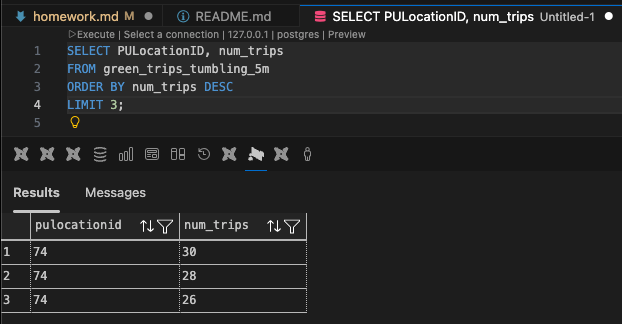
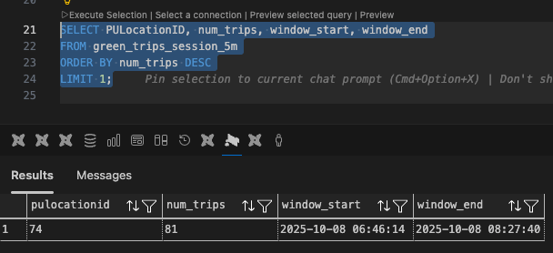
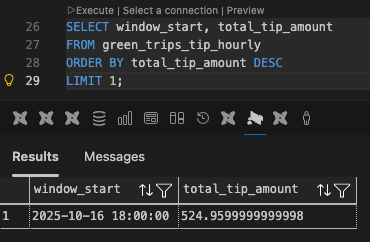

# Homework

## Clean Reset & Answering Workflow (Recommended)

If your results keep growing or don’t match the expected answers, it’s almost always due to re-sending data, stale offsets, or leftover results in PostgreSQL. Use this clean reset before answering the questions:

1. **Stop running Flink jobs** (Flink UI at http://localhost:8081 → select job → Cancel).
2. **Delete and recreate the Kafka topic**:
   ```bash
   docker compose exec redpanda rpk topic delete green-trips
   docker compose exec redpanda rpk topic create green-trips
   ```
3. **Truncate the PostgreSQL result tables** (if they already exist):
   ```sql
   TRUNCATE green_trips_tumbling_5m;
   TRUNCATE green_trips_session_5m;
   TRUNCATE green_trips_tip_hourly;
   ```
4. **Run the producer once** to send the dataset to Kafka.
5. **Submit the Flink jobs** (with parallelism = 1).
6. **Wait 1–2 minutes** for results, then query PostgreSQL.

Notes:
- Re-running the producer without deleting the topic will duplicate messages and inflate results.
- Restarting Flink jobs with `earliest` will reprocess all messages unless the topic is reset.
- Make sure parallelism is **1** for this homework (single partition).

## Prerequisites

- Docker + Docker Compose
- `uv` (or a Python environment with `kafka-python`, `pandas`, `pyarrow`)

## Start the Services

From `project/`:

```bash
docker compose up -d --build
```

Create the topic:

```bash
docker compose exec redpanda rpk topic create green-trips
```

## Orchestration Script

You can use the helper script to run the workflow end-to-end or step by step:

```bash
./run_all.sh all
```

Available commands:

- `up` build and start services
- `topic` create the `green-trips` topic
- `tables` create PostgreSQL tables for Q4–Q6
- `jobs` submit the three Flink jobs (detached)
- `producer` send the dataset to Kafka
- `down` stop and remove containers and volumes

## Question 1. Redpanda version

Run `rpk version` inside the Redpanda container:

```bash
(flink) rgctechfi@MacBookAir project % docker compose exe redpanda rpk version
```

What version of Redpanda are you running?

```bash
rpk version: v25.3.9
Git ref:     836b4a36ef6d5121edbb1e68f0f673c2a8a244e2
Build date:  2026 Feb 26 07 47 54 Thu
OS/Arch:     linux/arm64
Go version:  go1.24.3

Redpanda Cluster
  node-1  v25.3.9 - 836b4a36ef6d5121edbb1e68f0f673c2a8a244e2
```

<p align="center">
  
</p>

## Question 2. Sending data to Redpanda

Create a topic called `green-trips`:

```bash
(flink) rgctechfi@MacBookAir flink % uv run python project/src/producers/producer_green_trips.py
```

Now write a producer to send the green taxi data to this topic.

Read the parquet file and keep only these columns:

- `lpep_pickup_datetime`
- `lpep_dropoff_datetime`
- `PULocationID`
- `DOLocationID`
- `passenger_count`
- `trip_distance`
- `tip_amount`
- `total_amount`

Convert each row to a dictionary and send it to the `green-trips` topic.
You'll need to handle the datetime columns - convert them to strings
before serializing to JSON.

Measure the time it takes to send the entire dataset and flush:

```python
from time import time

t0 = time()

# send all rows ...

producer.flush()

t1 = time()
print(f'took {(t1 - t0):.2f} seconds')
```

How long did it take to send the data?

```bash
sent 49416 messages to green-trips
took 3.52 seconds
```

<p align="center">
  
</p>

## Question 3. Consumer - trip distance

Write a Kafka consumer that reads all messages from the `green-trips` topic
(set `auto_offset_reset='earliest'`).

Count how many trips have a `trip_distance` greater than 5.0 kilometers.

How many trips have `trip_distance` > 5?

```bash
(flink) rgctechfi@MacBookAir flink % uv run python project/src/consumers/consumer_green_trips_count.py
consumed 49416 messages
trips with distance > 5.0: 8506
```

<p align="center">
  
</p>

## Part 2: PyFlink (Questions 4-6)

For the PyFlink questions, you'll adapt the workshop code to work with
the green taxi data. The key differences from the workshop:

- Topic name: `green-trips` (instead of `rides`)
- Datetime columns use `lpep_` prefix (instead of `tpep_`)
- You'll need to handle timestamps as strings (not epoch milliseconds)

You can convert string timestamps to Flink timestamps in your source DDL:

```sql
lpep_pickup_datetime VARCHAR,
event_timestamp AS TO_TIMESTAMP(lpep_pickup_datetime, 'yyyy-MM-dd HH:mm:ss'),
WATERMARK FOR event_timestamp AS event_timestamp - INTERVAL '5' SECOND
```

Before running the Flink jobs, create the necessary PostgreSQL tables
for your results.

Important notes for the Flink jobs:

- Place your job files in `workshop/src/job/` - this directory is
  mounted into the Flink containers at `/opt/src/job/`
- Submit jobs with:
  `docker exec -it workshop-jobmanager-1 flink run -py /opt/src/job/your_job.py`
- The `green-trips` topic has 1 partition, so set parallelism to 1
  in your Flink jobs (`env.set_parallelism(1)`). With higher parallelism,
  idle consumer subtasks prevent the watermark from advancing.
- Flink streaming jobs run continuously. Let the job run for a minute
  or two until results appear in PostgreSQL, then query the results.
  You can cancel the job from the Flink UI at http://localhost:8081
- If you sent data to the topic multiple times, delete and recreate
  the topic to avoid duplicates:
  `docker exec -it workshop-redpanda-1 rpk topic delete green-trips`


## Question 4. Tumbling window - pickup location

Create a Flink job that reads from `green-trips` and uses a 5-minute
tumbling window to count trips per `PULocationID`.

Write the results to a PostgreSQL table with columns:
`window_start`, `PULocationID`, `num_trips`.

After the job processes all data, query the results:

Verify that the taskmanager container runs, jobmanager manages and taskmanager execute the work !

```bash
docker compose exec jobmanager ./bin/flink run \
  -py /opt/src/job/green_trips_tumbling_5m_job.py \
  --pyFiles /opt/src -d
```

```sql
SELECT PULocationID, num_trips
FROM green_trips_tumbling_5m
ORDER BY num_trips DESC
LIMIT 3;
```

Which `PULocationID` had the most trips in a single 5-minute window?



Adjust the image size by changing the `width` value above (e.g., `width="400"`).

<p align="center">
  
</p>

## Question 5. Session window - longest streak

Create another Flink job that uses a session window with a 5-minute gap
on `PULocationID`, using `lpep_pickup_datetime` as the event time
with a 5-second watermark tolerance.

A session window groups events that arrive within 5 minutes of each other.
When there's a gap of more than 5 minutes, the window closes.

Write the results to a PostgreSQL table and find the `PULocationID`
with the longest session (most trips in a single session).

How many trips were in the longest session?

```bash
docker compose exec jobmanager ./bin/flink run \
  -py /opt/src/job/green_trips_session_5m_job.py \
  --pyFiles /opt/src -d
```

SQL query:

```sql
SELECT PULocationID, num_trips
FROM green_trips_session_5m
ORDER BY num_trips DESC
LIMIT 1;
```



<p align="center">
  
</p>


## Question 6. Tumbling window - largest tip

Create a Flink job that uses a 1-hour tumbling window to compute the
total `tip_amount` per hour (across all locations).

Which hour had the highest total tip amount?

```bash
docker compose exec jobmanager ./bin/flink run \
  -py /opt/src/job/green_trips_tip_hourly_job.py \
  --pyFiles /opt/src -d
```

```sql
SELECT window_start, total_tip_amount
FROM green_trips_tip_hourly
ORDER BY total_tip_amount DESC
LIMIT 1;
```



<p align="center">
  
</p>